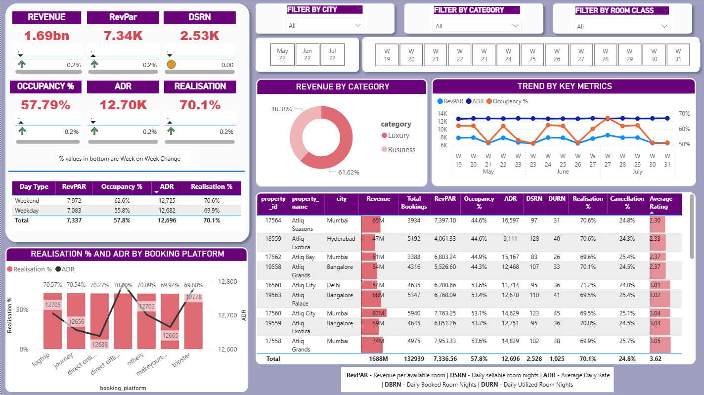

---

# **AtliQ Grands Hospitality Industry Analysis**

Power BI Dashboard | Hospitality Analytics | Data Cleaning & Transformation

 
---

##  **Project Overview**

AtliQ Grands Hospitality Analysis is a data-driven project focused on understanding hotel performance trends across multiple cities, categories, and room types.
Using data from Excel and transforming it in Power BI, this project analyzes revenue, occupancy, booking behavior, customer ratings, and room utilization patterns for hotels under the AtliQ Grands brand.

The result is an interactive **Power BI dashboard** that empowers hospitality stakeholders to make informed decisions through metrics such as ADR, Occupancy %, Revenue per Available Room (RevPAR), and Realization.

---

##  **Objectives**

* Clean and transform raw hospitality datasets.
* Create industry-standard hospitality KPIs.
* Build an interactive Power BI dashboard for operational and strategic insights.
* Identify patterns in booking platforms, cancellations, customer ratings, and occupancy.
* Standardize datasets to align with actual hospitality industry norms.

---

##  **Dataset Description**

The project is built on an Excel dataset containing bookings, properties, room types, and date-specific information. Below is the detailed column explanation:

### **1. Date & Time Information**

| Column       | Description                            |
| ------------ | -------------------------------------- |
| **date**     | Actual calendar date (May–July)        |
| **mmm yy**   | Month-year format (e.g., May 23)       |
| **week no**  | Unique week number for each date       |
| **day_type** | Weekend / Weekday (later recalculated) |

### **2. Property Information**

| Column            | Description                     |
| ----------------- | ------------------------------- |
| **property_id**   | Unique ID for each hotel        |
| **property_name** | Name of the hotel               |
| **category**      | Hotel class (Luxury / Business) |
| **city**          | Hotel location                  |

### **3. Room Details**

| Column                      | Description                            |
| --------------------------- | -------------------------------------- |
| **room_id / room_category** | RT1, RT2, RT3, RT4                     |
| **room_class**              | Standard, Elite, Premium, Presidential |
| **capacity**                | Max room availability per type per day |

### **4. Booking & Customer Information**

| Column                  | Description                                       |
| ----------------------- | ------------------------------------------------- |
| **booking_id**          | Unique booking reference                          |
| **booking_date**        | Date on which the booking was made                |
| **check_in_date**       | Customer check-in date                            |
| **check_out_date**      | Customer check-out date                           |
| **no_guests**           | Number of guests in the room                      |
| **booking_platform**    | Method used (App, Website, Travel partners, etc.) |
| **successful_bookings** | Bookings fulfilled successfully                   |
| **booking_status**      | Checked Out / Cancelled / No Show                 |

### **5. Financial Metrics**

| Column                | Description                                                             |
| --------------------- | ----------------------------------------------------------------------- |
| **revenue_generated** | Total amount charged                                                    |
| **revenue_realized**  | Final revenue retained by hotel (rules applied based on booking status) |

---

##  **New Metrics Created in Power BI**

### **1. Revenue per Available Room (RevPAR)**

```
Total Revenue / Total Rooms Available to Sell
```

### **2. Average Daily Rate (ADR)**

```
Total Rooms Revenue / Number of Rooms Sold
```

### **3. Occupancy %**

```
Total Rooms Occupied / Total Rooms Available
```

### **4. SRN – Sellable Room Nights**

Total number of rooms available in the month.
Example: 100 rooms × 30 days = **3000 SRN**

### **5. DSRN – Daily Sellable Room Nights**

Room availability per day (used for daily-level KPIs).

### **6. URN – Utilized Room Nights**

Total occupied rooms on a given day.

### **7. BRN – Booked Room Nights**

```
BRN = URN + No Shows + Cancellations
```

---

##  **Data Cleaning & Transformation**

### **1. dim_date Cleanup**

* Removed column **day_type** due to incorrect weekend logic.
* Industry standard: **Weekend = Friday & Saturday**
* Recreated `day_type` using a calculated column in Power BI.

### **2. dim_rooms Fix**

* Column names were incorrectly stored in the first data row.
* Applied **"Use First Row as Headers"** to correct the dataset.

### **3. Other Transformations**

* Ensured consistent room type (RT1–RT4) mapping across tables.
* Converted date columns to correct data types.
* Created relationships between:

  * Date → Booking fact table
  * Property → Room → Booking
* Added DAX measures for all KPIs listed above.

---

##  **Power BI Dashboard Highlights**

The dashboard provides insights into:

✔ Hotel occupancy trends
✔ Revenue analysis (realized vs generated)
✔ City-wise and property-wise performance
✔ Room-class demand distribution
✔ Cancellation & no-show patterns
✔ Platform-wise booking analytics
✔ Customer rating distribution

---

##  **Project Structure**

```
 AtliQ-Grands-Hospitality-Analysis
 ┣  PowerBI_Dashboard.pbix
 ┣  Dataset
 ┃ ┗ Atliq_Hospitality_Data.xlsx
 ┣  README.md
 ┗  Documentation (optional)
```

---

##  **Skills Demonstrated**

* Power BI (Data Modeling, DAX, Dashboard Design)
* Data Cleaning & Transformation
* Hospitality Industry Metrics
* Business Intelligence & Data Analytics

---

##  **Contact**

For queries or collaboration opportunities, connect with me on GitHub or LinkedIn.

---

